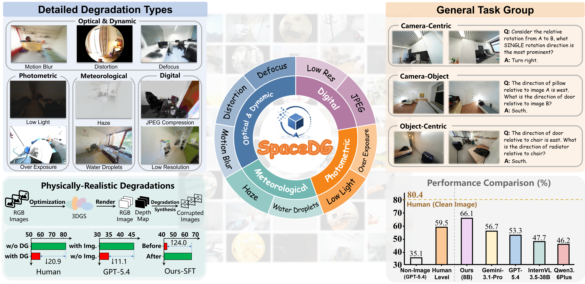

#  SpaceDG: Benchmarking Spatial Intelligence under Visual Degradation

[🌐 Homepage](https://github.com/Visionary-Laboratory/SpaceDG) | [🤗 Benchmark](https://huggingface.co/datasets/xlzhou126/SpaceDG-Bench) | 📖 arXiv (TBD)

## Overview

Multimodal Large Language Models (MLLMs) have improved spatial reasoning, yet most benchmarks assume pristine images and ignore real degradations such as motion blur, low light, adverse weather, lens distortion, and compression. This raises a fundamental question: How robust is spatial intelligence when observations are imperfect? To address this question, we introduce **SpaceDG**, the first large-scale dataset for degradation-aware spatial understanding: a physically grounded synthesis pipeline embeds nine degradation types into 3D Gaussian Splatting rendering, yielding roughly 1M QA pairs across nearly 1,000 indoor scenes. We further release **SpaceDG-Bench**, a human-verified benchmark with 1,102 questions spanning 11 reasoning categories and 9 degradation types (10K+ VQA instances). We conduct a comprehensive evaluation of 25 open- and closed-source models. Our analysis identifies four key findings:

- **First**, visual degradations consistently impair spatial reasoning across all evaluated MLLMs, highlighting the need for degradation-aware spatial evaluation.
- **Second**, humans also suffer clear performance drops under degraded conditions. This suggests that the design of MLLMs should not simply imitate human perception, but should learn degradation-aware spatial knowledge to better handle diverse real-world visual inputs.
- **Third**, degradation-based supervised fine-tuning yields substantial improvements on both clean and degraded inputs, indicating that exposure to physically grounded degradations can enhance robust spatial understanding.
- **Finally**, visual degradations affect fine-grained object-level perception (such as object counting) more strongly than certain geometric reasoning tasks (such as camera-centric translation), revealing that detailed visual grounding is particularly sensitive to degraded visual evidence.



## Quick Start (EASI Evaluation)

### 1) Environment Setup

Use the EASI setup script to prepare the runtime environment with uv.

```bash
git clone https://github.com/Visionary-Laboratory/SpaceDG.git
cd SpaceDG/EASI
bash scripts/setup.sh
```

### 2) Prepare Data

Get **SpaceDG-Bench** from Hugging Face (file layout and notes are on the dataset card):

- [`xlzhou126/SpaceDG-Bench`](https://huggingface.co/datasets/xlzhou126/SpaceDG-Bench)

**Default:** the first time you evaluate with `--data spacedg_bench`, the VLMEvalKit dataset loader downloads `spacedg_bench.tsv` and the parquet shards, runs in-repo image extraction (`prepare_data` inside `spacedg_bench.py`), and caches assets under **`~/LMUData`**. You do **not** need a separate `prepare_data.py` script.

**Offline / pre-downloaded tree:** if you already have a directory containing `spacedg_bench.tsv` and the image files so every `image_path` in the TSV resolves, set:

```bash
export SPACEDG_BENCH_ROOT=/path/to/SpaceDG_Bench
```

That skips all Hugging Face downloads for this benchmark. Otherwise, follow the usual VLMEvalKit / EASI environment setup.

### 3) Run Evaluation with VLMEvalKit

We provide an example launcher script:

- `EASI/VLMEvalKit/scripts/run_spacedg_bench.sh`

Or run `torchrun` directly from the VLMEvalKit root:

```bash
cd <PATH_TO_THIS_REPO>/SpaceDG/EASI/VLMEvalKit

CUDA_VISIBLE_DEVICES=0,1,2,3,4,5,6,7 torchrun run.py \
  --model InternVL3_5-8B \
  --data spacedg_bench \
  --mode all \
  --work-dir ../outputs_spacedg \
  --reuse
```

## TODO

- [ ] Release full SpaceDG dataset.

- [x] Release SpaceDG-Bench and evaluation code.

- [ ] Release the full paper and the project page of SpaceDG.
